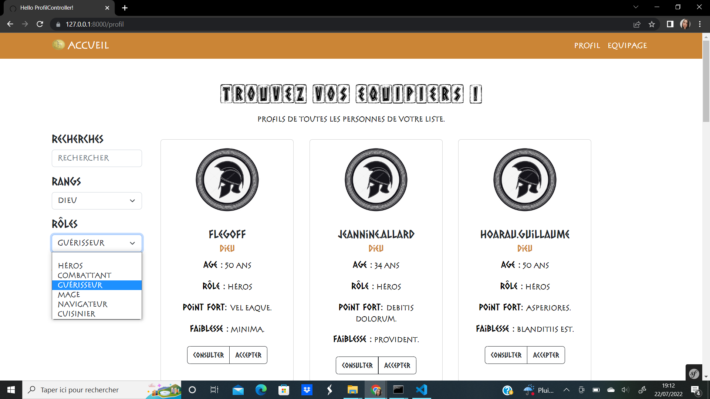
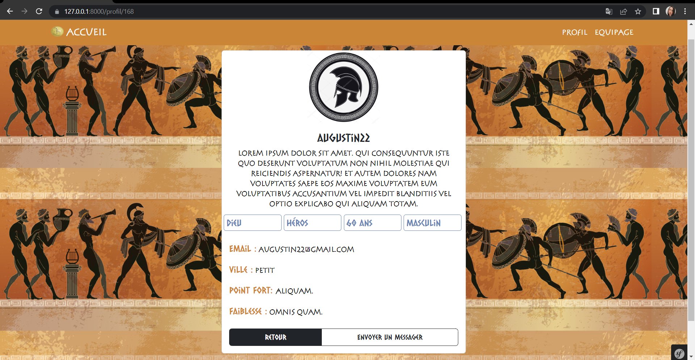
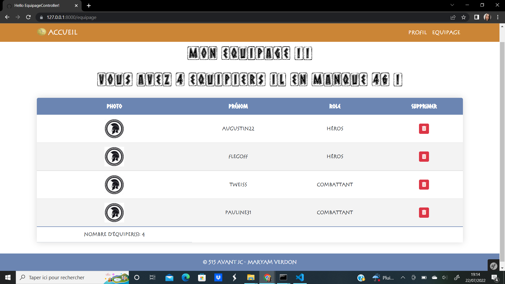

# Jason App : Application de création d'un équipage
Cette application à pour but de permettre à Jason de composer son équipage de 50 équipers pour aller récupérer la toison d’or. 

Technologies utilisées : `Symfony`, `Bootstrap`, `JavaScript`

## Comment participer au projet ?

1. Git clone

        $ git clone https://github.com/MaryamVerdon/jason_app.git

2. Démarrer le serveur

        $ composer start

3. Installer les dépendances si besoin

        $ composer install

4. Créer la BDD
    - Dupliquer le fichier `.env` et le renommer en `.env.local`
    - Modifier la ligne commençant par `DATABASE_URL`
    - Créer la BDD avec la commande
        
            $ bin/console doctrine:schema:create
    
    - Générer les données avec la commande

            $ bin/console doctrine:fixtures:load

 ## Le projet
 Comme décrit ci-dessus, ce projet est une application permettant de choisir ses équipiers parmi une centaine de profils différents. 

 ### Fonctionnalités du projet
 
  - Affichage de tous les profils 
  - Tri des profils par âge, rôle, rang
  - Système de pagination
  - Affichage d'une fiche profil
  - Ajout/Supression d'un équipier dans l'équipage (système de Session)
  
  ## Rendu final
  ### Page Profils & Tri
  
  
   ### Page Fiche Profil
  
    
   ### Page Equipage
  
  
  
## Démo
 
https://user-images.githubusercontent.com/74917307/180499780-9c4d0c92-4034-4150-8acc-f865cac3046a.mp4

